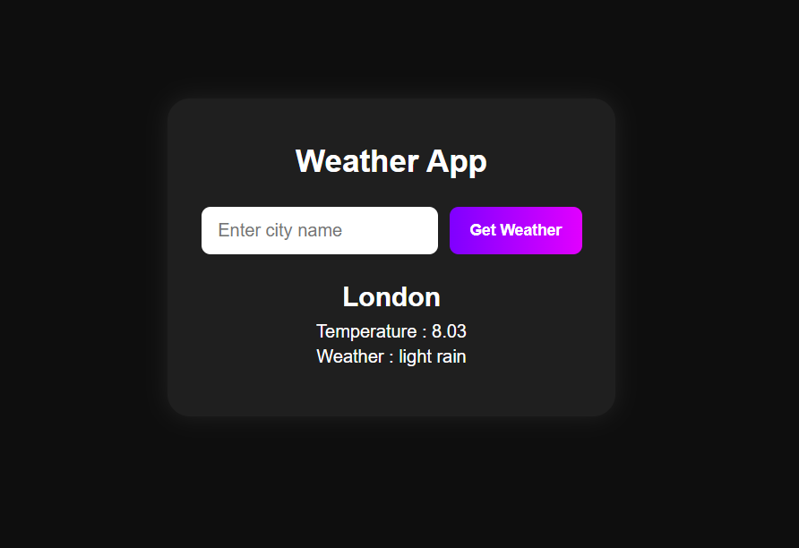
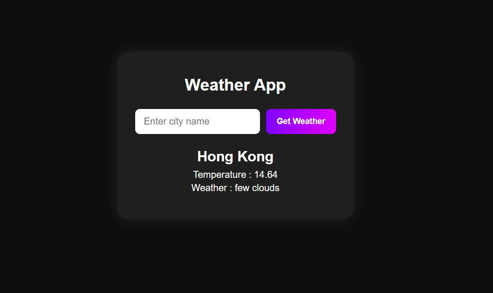

## 🌦 Weather App Web Application

A simple and responsive Weather Application built using HTML, CSS, and JavaScript.
It allows users to search for any city and get real-time weather information using the OpenWeatherMap API.

---

## 🚀 Live Demo

🔗 https://student-sayan75.github.io/Weather-App/
<br>⚠️ Live Demo Limitation
This project uses a third-party API that requires a private API key.<br>
To keep the key secure, the live demo showcases the frontend UI only.<br>
Weather data will be fetched after setting up your own API key locally<br>

## 🎥 Demo Video

▶️ https://www.youtube.com/watch?v=YOUR_VIDEO_LINK

## 🛠 Tech Stack

- HTML5
- CSS3
- JavaScript (Vanilla JS)
- OpenWeatherMap API

---

## ✨ Features

- Search weather by city name
- Displays:
- City name
- Temperature (°C)
- Weather condition (e.g., haze, clear, rain)
- Error handling for invalid city names
- Clean and modern UI
- Fully responsive design
- Uses async/await for API calls

---

## 📸 Screenshots





---

## 📂 Project Structure

```
│── index.html
│── style.css
│── script.js
│── screenshots/
│── README.md
```

---

## ▶️ How to Run Locally

Clone the repository
git clone https://github.com/student-Sayan75/Weather-App.git

---

## 🔐 API Configuration

This project uses OpenWeatherMap API.

Create an account at
https://openweathermap.org/

- Generate your API key
- Replace the API key in script.js
- const API_KEY = "YOUR_API_KEY";

---

## 🔮 Future Improvements

- Add weather icons 🌤
- Show humidity & wind speed
- Auto-detect user location
- 5-day weather forecast
- Dark / light mode toggle

---

## 👨‍💻 Author

Sayan Ali Mallick<br>
📍 India<br>
💻 Aspiring Full Stack Developer
